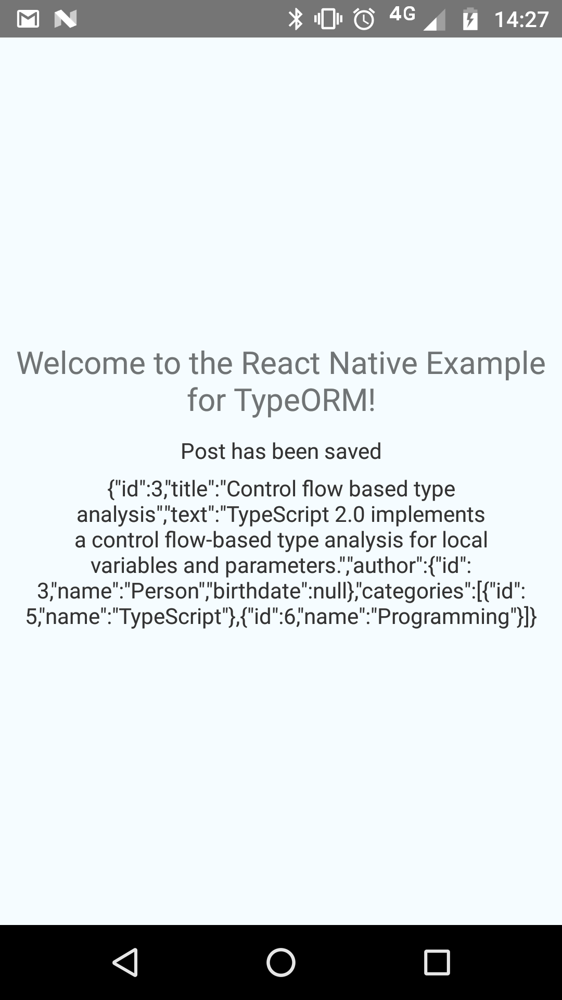

# Using TypeORM with React Nactive
Starting with 0.2.0-alpha.44 TypeORM supports React Native with the [`react-native-sqlite-storage`](https://github.com/andpor/react-native-sqlite-storage) plugin.
This example shows how you can use TypeORM in your app.
Use `react-native run-android` to run this example on your device.

## Add TypeORM to your app
1. Follow the installation step for [iOS](https://github.com/andpor/react-native-sqlite-storage#how-to-use-ios) and [Android](https://github.com/andpor/react-native-sqlite-storage#how-to-use-android) for the plugin
2. Install TypeORM: `npm install typeorm --save`
3. Install Node.js types: `npm install @types/node --save-dev`
4. Add `skipLibCheck: true` to your `tsconfig.json`-file (Node.js and React Native define `require`)
5. Use `react-native` as `type` for your connection option (read more about [connection options](http://typeorm.io/#/connection-options/))

